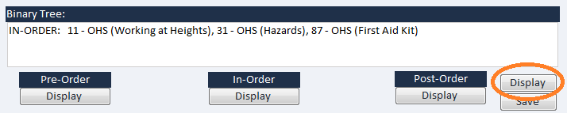

# Network Quiz

A system that delivers quick quiz questions via the department’s network to all staff.

See screen-shots below:

The team manager selects a quick quiz question from the list within the table on the left hand side of the  screen. The detail of the selected question is displayed on the right of the table. The team manager clicks on the **Send** button to send the question to all the staff on the network within the office. The team manager then waits for the staff to respond.

Each staff will have entered their name in the text field at the top of their Quick Quiz pop-up form.

Each staff reads the current question and the possible answers, and then enters and submits (**Submit** button) what they believe to be the correct answer option – `A`, `B`, `C`or `D`.

Once the **Submit** button is pressed a pop-up form displays indicating whether the staff’s answer is correct.

The quality team manager receives the answers from each staff and the program collates how many staff may have answered incorrectly.

If one of more staff has answered incorrectly, the program adds the question to the Doubly Linked List. The
`Doubly Linked List` records the `Question Number`, the `Question Topic`, the `Sub-Topic` in parentheses, and the total number of staff who have answered incorrectly.

The program then re-displays the current full content of the `Doubly Linked List` in the `Linked List` display text area.

When the team manager clicks on the **Send** button, the question is added to a binary tree. Each binary tree node records the question number (key) plus the question topic, and the subtopic (in parentheses).

The user can click on the `Pre-Order`, `In-Order` and `Post-Order` **Display** buttons to display the corresponding listing of the binary tree content in the `Binary Tree` text area.

The **Save** button will save the binary tree content into an appropriately named text file. Apply a hashing algorithm to the output of this files.

The program utilizes a third party library as part of its implementation.

Code is included for searching both the `Doubly Linked List` and the `Binary Tree`.

The user would click on the **Display** button on the right of the `Binary Tree` text area.

Graphically display the binary tree - as a tree - within a graphics screen.

